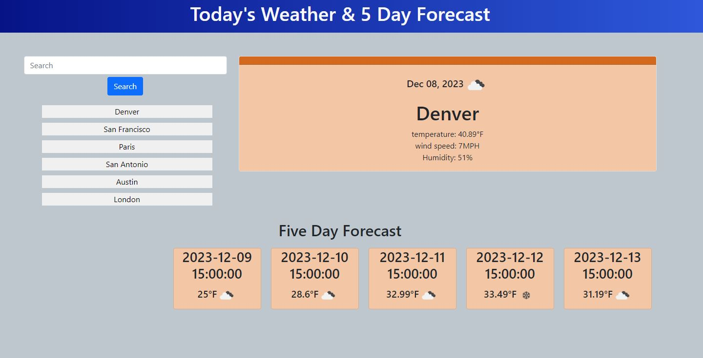

# weather-dashboard

## Description

A website to check the weather in any city the user chooses. Type a city into the searchbar to get the current weather as well as a 5-day forecast for the current time.
Search history will be saved locally to re-check conveniently

## Credits

Aaron Lyman: Openweather API Geocode call. Weather Icon population. CSS.

Chance Creger: Debugging city weather call. debugging search history buttons. HTML Boilerplate. Bootstrap call.

Daniel Goss: Local storage function. search history buttons. search history button function. 5 day forecast api call

Gabe Latimer: Base HTML. 5 day forecast api call. Five day forecast card generation. debugging on Five day forecast.

## Screenshot

## Links

Repo: https://github.com/aalyman42/weather-dashboard

Deployed site: https://aalyman42.github.io/weather-dashboard
